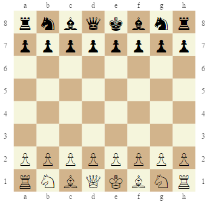
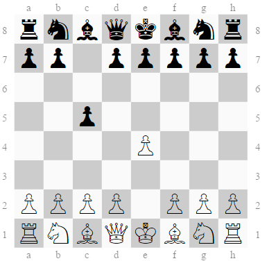

# D3 Chessboard ♕

A chessboard *a la* D3. No CSS, no images, no (chess) validations, just a chessboard 
using the spirit of [reusable charts](http://bost.ocks.org/mike/chart/).

## Live Demo

You can see how it looks [here](https://rawgit.com/jbkunst/vizs/master/d3-chessboard/index.html).

## How to use

1. Choose your selector!
2. Create the `d3chessboard()` element
3. Call it!

```
var sel = d3.select("#chess-container");
var board = d3chessboard();
sel.call(board);
```



## Options

You can use a [FEN](https://en.wikipedia.org/wiki/Forsyth%E2%80%93Edwards_Notation) string to plot a specific position.
```
var fenstring = "rnbqkbnr/pp1ppppp/8/2p5/4P3/8/PPPP1PPP/RNBQKBNR w KQkq c6 0 2";
var sel2 = d3.select("#chess-container2")
var board2 = d3chessboard()
				.fen(fenstring)
				.width(450)
				.height(450)
				.whitecellcolor("#FAFAFA")
				.blackcellcolor("#CCC");

sel2.call(board2);
```


## Requirements

This plugin needs [jhlywa' chessjs](https://github.com/jhlywa/chess.js). Check `index.html`.

Aps! Obviously you need [d3js](http://d3js.org/) too!

## References

1. http://bost.ocks.org/mike/chart/
2. https://github.com/jhlywa/chess.js
3. http://d3js.org/
4. [Day/Hour Heatmap by tjdecke](http://bl.ocks.org/tjdecke/5558084)
5. http://stackoverflow.com/questions/27806132/how-to-draw-a-chess-board-in-d3
6. http://stackoverflow.com/questions/12303989/cartesian-product-of-multiple-arrays-in-javascript
